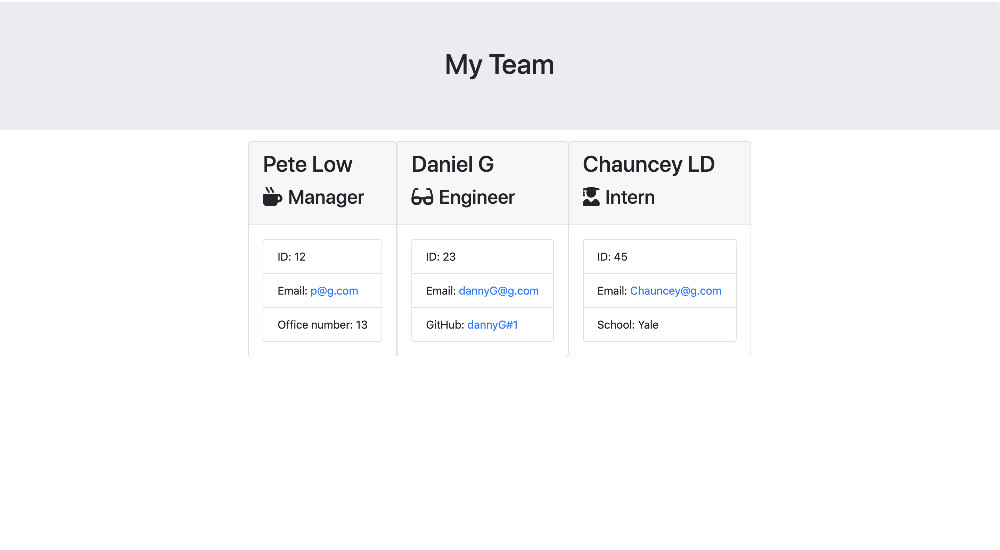

# Employee Summary

This can be used to generate an employee directory for different types of employees.
## Table of Contents
- [Usage](#usage)
- [Contributing](#contributing)
- [Images](#images)
- [Questions](#questions)

## Usage

This project utilizes inquirer to help generate employee contact info for three different types of compamny roles. When run through the comand line starting at the app.js file the user is prompted to answer a series of questions about different employees. After the last employee is added the HTML will be rendered in the output folder.

## Images

Screen shot of rendered contact page in browser: 

Using the app in the comand line:

## Repository
- https://github.com/PeteLow-13/EmployeeSummary
## Questions

Contact me via email or github with questions
- pedritolow@gmail.com
- [PeteLow-13](http://github.com/github)
